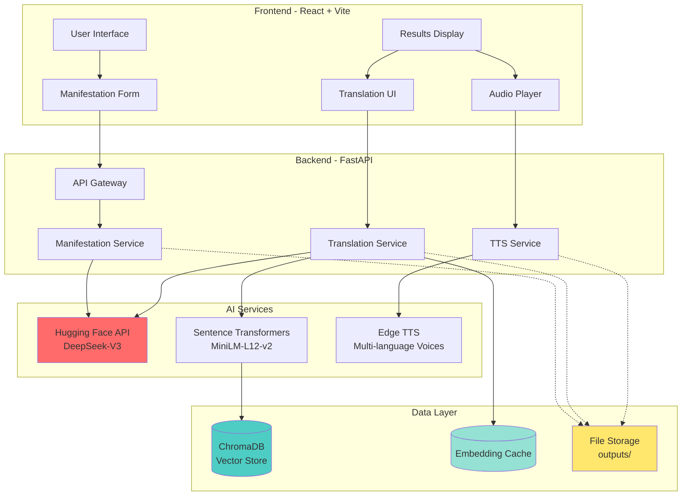
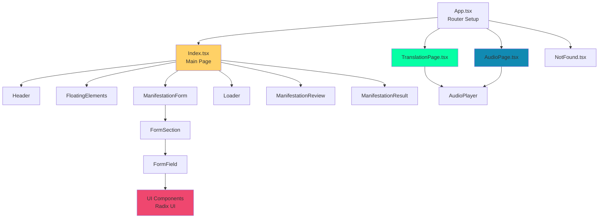
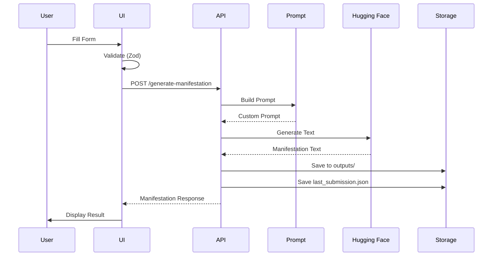
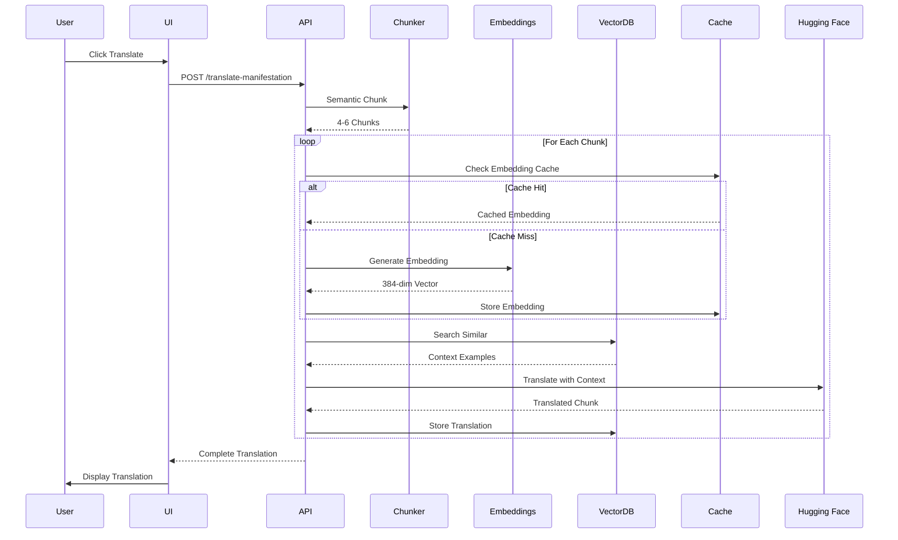
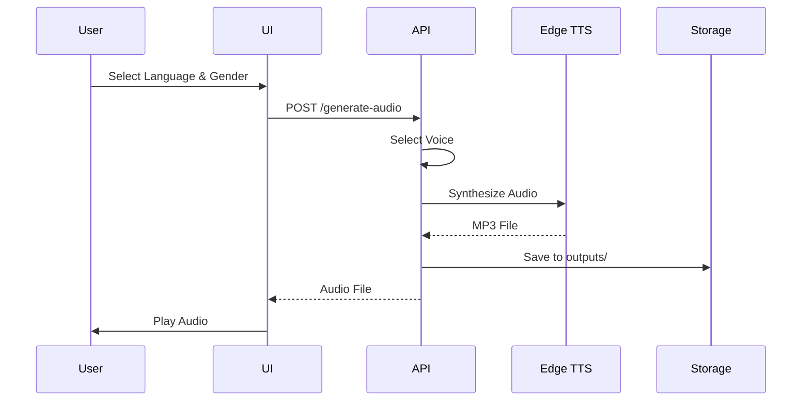

# AfflimAI Architecture Documentation

## Table of Contents
- [System Overview](#system-overview)
- [Technology Stack](#technology-stack)
- [Backend Architecture](#backend-architecture)
- [Frontend Architecture](#frontend-architecture)
- [Data Flow](#data-flow)
- [RAG Translation System](#rag-translation-system)
- [Database & Storage](#database--storage)
- [Security Considerations](#security-considerations)

---

## System Overview

AfflimAI is a full-stack AI-powered manifestation generator that combines astrological wisdom, psychological insights, and advanced AI to create personalized manifestations in multiple languages with audio output.

### High-Level Architecture



### Core Features

1. **Personalized Manifestation Generation**
   - Astrological integration (Nakshatra, Lagna)
   - Psychological profiling (strengths, goals, achievements)
   - AI-powered unique content generation

2. **Multi-Language Translation**
   - RAG-based translation with context awareness
   - Support for Tamil (தமிழ்) and Hindi (हिन्दी)
   - Translation memory for consistency

3. **Multi-Language Audio**
   - Native voices for each language
   - Gender options (Male/Female)
   - High-quality TTS output

---

## Technology Stack

### Frontend Stack

| Technology | Version | Purpose |
|------------|---------|---------|
| **React** | 18.3.1 | UI framework |
| **TypeScript** | 5.8.3 | Type safety |
| **Vite** | 5.4.19 | Build tool & dev server |
| **Tailwind CSS** | 3.4.17 | Styling |
| **Radix UI** | Various | Accessible UI components |
| **TanStack Query** | 5.83.0 | Server state management |
| **React Hook Form** | 7.61.1 | Form handling |
| **Zod** | 3.25.76 | Schema validation |
| **Sonner** | 1.7.4 | Toast notifications |
| **Lucide React** | 0.462.0 | Icons |

### Backend Stack

| Technology | Version | Purpose |
|------------|---------|---------|
| **FastAPI** | Latest | Web framework |
| **Python** | 3.11+ | Runtime |
| **Uvicorn** | Latest | ASGI server |
| **Pydantic** | Latest | Data validation |
| **ChromaDB** | Latest | Vector database |
| **Sentence Transformers** | Latest | Embeddings |
| **NLTK** | Latest | Text processing |
| **Edge TTS** | Latest | Text-to-speech |
| **Requests** | Latest | HTTP client |
| **Python-dotenv** | Latest | Environment config |

### AI Services

| Service | Model | Purpose |
|---------|-------|---------|
| **Hugging Face** | DeepSeek-V3 | LLM for generation & translation |
| **Sentence Transformers** | MiniLM-L12-v2 | Multilingual embeddings |
| **Microsoft Edge TTS** | Various voices | Multi-language audio synthesis |

---

## Backend Architecture

### Modular Structure

```
backend/
├── app/                      # Core application modules
│   ├── main.py              # FastAPI app initialization
│   ├── config.py            # Configuration management
│   ├── schemas.py           # Pydantic models
│   ├── prompt.py            # Prompt engineering
│   ├── hf_client.py         # Hugging Face API client
│   ├── tts.py               # Text-to-speech service
│   ├── embeddings.py        # Multilingual embeddings
│   ├── chunker.py           # Semantic text chunking
│   ├── vector_store.py      # ChromaDB operations
│   ├── rag_translate.py     # RAG translation pipeline
│   └── cache.py             # Embedding cache system
├── api/                     # API layer
│   └── v1/
│       ├── router.py        # API router
│       └── endpoints/
│           ├── manifestation.py
│           ├── translation.py
│           └── tts.py
├── outputs/                 # Generated files
├── chroma_db/              # Vector database storage
└── cache/                   # Embedding cache
```

### Service Layer Design

```mermaid
graph LR
    subgraph "API Endpoints"
        E1[Manifestation]
        E2[Translation]
        E3[TTS]
        E4[Utils]
    end
    
    subgraph "Core Services"
        S1[Prompt Generator]
        S2[HF Client]
        S3[RAG Translator]
        S4[TTS Service]
    end
    
    subgraph "Infrastructure"
        I1[Vector Store]
        I2[Embeddings]
        I3[Chunker]
        I4[Cache]
    end
    
    E1 --> S1
    E1 --> S2
    E2 --> S3
    S3 --> I1
    S3 --> I2
    S3 --> I3
    S3 --> I4
    S3 --> S2
    E3 --> S4
    
    style E1 fill:#a8dadc
    style E2 fill:#a8dadc
    style E3 fill:#a8dadc
    style S1 fill:#457b9d
    style S2 fill:#457b9d
    style S3 fill:#457b9d
    style S4 fill:#457b9d
    style I1 fill:#1d3557
    style I2 fill:#1d3557
    style I3 fill:#1d3557
    style I4 fill:#1d3557
```



### Key Modules

#### 1. **main.py** - Application Entry Point
- FastAPI app initialization
- CORS middleware configuration
- API router registration
- Health check endpoint

#### 2. **hf_client.py** - Hugging Face Integration
- API authentication
- Text generation requests
- Error handling & retries
- Response parsing

#### 3. **rag_translate.py** - Translation Pipeline
- RAG-based translation orchestration
- Context retrieval from vector store
- LLM translation with examples
- Translation memory updates

#### 4. **vector_store.py** - ChromaDB Operations
- Collection management
- Document insertion
- Similarity search
- Metadata handling

#### 5. **embeddings.py** - Embedding Generation
- Multilingual embedding model
- Batch processing
- Normalization
- Caching integration

#### 6. **cache.py** - Performance Optimization
- Embedding cache (90% speed improvement)
- File-based persistence
- Hash-based lookups
- Automatic cache management

#### 7. **chunker.py** - Semantic Chunking
- NLTK sentence tokenization
- Intelligent chunk boundaries
- Optimal chunk sizing (4-6 chunks)
- Context preservation

#### 8. **tts.py** - Audio Synthesis
- Multi-language voice mapping
- Edge TTS integration
- Audio file generation
- Persistent storage

---

## Frontend Architecture

### Component Hierarchy



### State Management

**Local State (useState)**
- Form data
- UI state (loading, errors)
- Manifestation text
- Translation results
- Audio playback state

**URL State (React Router)**
- Page navigation
- Return state from translation/audio pages
- Username preservation across routes

**Server State (TanStack Query)**
- API calls
- Caching
- Background refetching
- Error retry logic

### Key Pages

#### 1. **Index.tsx** - Main Manifestation Flow
States: `form` → `loading` → `review` → `result`

```typescript
type AppState = "form" | "loading" | "review" | "result";
```

Handles:
- Form submission
- Manifestation generation
- Edit & confirmation
- Navigation to translation/audio

#### 2. **TranslationPage.tsx** - Multi-Language Translation
Manages:
- Language selection (Tamil, Hindi)
- Translation API calls
- Translation status tracking
- Disable audio until translation completes

#### 3. **AudioPage.tsx** - Audio Generation
Handles:
- Language selection (only translated languages)
- Gender selection (Male/Female)
- Audio generation
- Playback controls

---

## Data Flow

### 1. Manifestation Generation Flow



### 2. Translation Flow (RAG-Based)



### 3. Audio Generation Flow



---

## RAG Translation System

### Architecture Overview

The RAG (Retrieval-Augmented Generation) system ensures high-quality, consistent translations by leveraging a vector database to store and retrieve translation examples.

### Pipeline Steps

1. **Semantic Chunking**
   - Input text split into 4-6 meaningful chunks
   - Preserves sentence boundaries
   - Maintains context within chunks

2. **Embedding Generation**
   - 384-dimensional multilingual vectors
   - Model: `sentence-transformers/paraphrase-multilingual-MiniLM-L12-v2`
   - Cached for 90% performance boost

3. **Vector Similarity Search**
   - ChromaDB cosine similarity
   - Top-k relevant examples retrieved
   - User-specific context when available

4. **Context-Aware Translation**
   - LLM prompted with examples
   - Cultural adaptation instructions
   - Emotional tone preservation

5. **Translation Memory Update**
   - New translations stored in vector DB
   - Builds knowledge base over time
   - Ensures consistency across users

### Performance Characteristics

| Metric | First Translation | Cached Translation |
|--------|------------------|-------------------|
| **Time** | 30-40 seconds | 5-8 seconds |
| **Embedding Generation** | ~2s per chunk | ~0.1s (cached) |
| **Vector Search** | ~100ms | ~100ms |
| **LLM Translation** | ~5-8s per chunk | ~5-8s per chunk |
| **Cache Hit Rate** | 0% | 80%+ |

---

## Database & Storage

### ChromaDB (Vector Database)

**Purpose**: Persistent storage for embeddings and translations

**Collections**:
- User-specific collections: `translations_{username}`
- Stores: original text, translated text, embeddings, metadata

**Configuration**:
```python
# Persistent storage
client = chromadb.PersistentClient(path="./chroma_db")

# Collection with L2 distance metric
collection = client.get_or_create_collection(
    name=f"translations_{username}",
    metadata={"hnsw:space": "l2"}
)
```

### File Storage

**Directory**: `outputs/`

**Files Stored**:
1. **Manifestations**: `{username}_{timestamp}.txt`
2. **Translations**: `{username}_{lang_code}_{timestamp}.txt`
3. **Audio**: `{username}_{lang_code}_{timestamp}.mp3`
4. **Last Submission**: `last_submission.json` (auto-fill data)

### Embedding Cache

**Directory**: `cache/`

**Format**: JSON files with hash-based keys

**Structure**:
```json
{
  "text_hash_1234": {
    "embedding": [0.123, 0.456, ...],
    "timestamp": "2026-01-02T09:55:00"
  }
}
```

---

## Security Considerations

### Current Security Posture

> [!WARNING]
> **Production Security Requirements**
> The current implementation is designed for development/demo purposes. Before production deployment, implement:
> - Authentication & authorization
> - Rate limiting
> - Input sanitization (enhanced)
> - API key rotation
> - CORS restrictions
> - HTTPS enforcement

### Implemented Security

1. **Input Validation**
   - Pydantic schemas validate all inputs
   - Type checking prevents injection
   - Safe filename generation

2. **CORS Configuration**
   - Currently: `allow_origins=["*"]` (development)
   - Production: Whitelist specific domains

3. **API Key Management**
   - Hugging Face API key in `.env`
   - Not exposed to frontend
   - Environment-based configuration

### Recommended Enhancements

1. **User Authentication**
   - JWT-based auth
   - User accounts & sessions
   - Personal data protection

2. **Rate Limiting**
   - Per-IP limits
   - Per-user limits
   - API quota management

3. **Data Privacy**
   - Encryption at rest
   - Secure file storage
   - GDPR compliance

4. **Monitoring**
   - Request logging
   - Error tracking (Sentry)
   - Performance monitoring (Prometheus)

---

## Scaling Considerations

### Current Limitations

- **Single-instance deployment**: No load balancing
- **File-based storage**: Limited scalability
- **Synchronous processing**: Blocking operations
- **No caching layer**: Each request hits services

### Scaling Recommendations

1. **Horizontal Scaling**
   - Deploy multiple backend instances
   - Load balancer (Nginx, AWS ALB)
   - Shared storage (S3, GCS)

2. **Database Scaling**
   - Managed ChromaDB or Pinecone
   - Separate cache layer (Redis)
   - CDN for static files

3. **Async Processing**
   - Background job queue (Celery, RQ)
   - Async audio generation
   - Webhook-based notifications

4. **Caching Strategy**
   - Redis for API responses
   - CDN for audio files
   - Browser caching for static assets

---

## Development Workflow

### Local Development

1. **Backend**: Hot-reload with Uvicorn
2. **Frontend**: HMR with Vite
3. **Testing**: Manual testing via UI + API docs
4. **Debugging**: Python logging + Browser DevTools

### Production Deployment

See [DEPLOYMENT.md](./DEPLOYMENT.md) for detailed instructions.

---

## Future Architecture Improvements

1. **Microservices**
   - Separate translation service
   - Dedicated TTS service
   - Independent scaling

2. **Event-Driven Architecture**
   - Message queue (RabbitMQ, Kafka)
   - Async processing
   - Event sourcing

3. **GraphQL API**
   - More flexible data fetching
   - Reduced over-fetching
   - Better type safety

4. **Real-Time Features**
   - WebSocket for live updates
   - Progress tracking
   - Live translation previews

---

*Last Updated: January 2, 2026*
