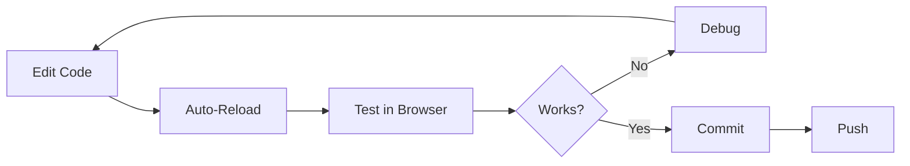

# Developer Guide

## Table of Contents
- [Getting Started](#getting-started)
- [Project Structure](#project-structure)
- [Development Workflow](#development-workflow)
- [Adding New Features](#adding-new-features)
- [Testing](#testing)
- [Code Style](#code-style)
- [Debugging](#debugging)
- [Git Workflow](#git-workflow)

---

## Getting Started

### Prerequisites

Before you begin, ensure you have the following installed:

- **Node.js**: v18+ ([Download](https://nodejs.org/))
- **Python**: 3.10+ ([Download](https://python.org/))
- **Git**: Latest version
- **Code Editor**: VS Code (recommended) with extensions:
  - Python
  - ESLint
  - Prettier
  - Tailwind CSS IntelliSense

### Initial Setup

#### 1. Clone the Repository

```bash
git clone https://github.com/yourusername/AfflimAI.git
cd AfflimAI
```

#### 2. Backend Setup

```bash
cd backend

# Create virtual environment
python3 -m venv venv

# Activate virtual environment
# macOS/Linux:
source venv/bin/activate
# Windows:
venv\Scripts\activate

# Install dependencies
pip install -r requirements.txt

# Download NLTK data
python3 -c "import nltk; nltk.download('punkt'); nltk.download('punkt_tab')"

# Create environment file
cp .env.example .env  # If .env.example exists, otherwise create manually
# Edit .env and add your Hugging Face API key
```

**`.env` file**:
```bash
HUGGINGFACE_API_KEY=your_hugging_face_api_key_here
MODEL_ID=deepseek-ai/DeepSeek-V3
```

> [!TIP]
> **Get a Hugging Face API Key**
> 1. Sign up at [huggingface.co](https://huggingface.co)
> 2. Go to Settings → Access Tokens
> 3. Create a new token (read access is sufficient)
> 4. Copy and paste into `.env`

#### 3. Frontend Setup

```bash
cd ../frontend

# Install dependencies
npm install

# No additional configuration needed for development
```

#### 4. Start Development Servers

**Terminal 1 - Backend**:
```bash
cd backend
source venv/bin/activate  # Activate if not already active
uvicorn app.main:app --reload
```

You should see:
```
INFO:     Uvicorn running on http://127.0.0.1:8000 (Press CTRL+C to quit)
INFO:     Started reloader process
INFO:     Started server process
INFO:     Waiting for application startup.
INFO:     Application startup complete.
```

**Terminal 2 - Frontend**:
```bash
cd frontend
npm run dev
```

You should see:
```
  VITE v5.4.19  ready in 523 ms

  ➜  Local:   http://localhost:8080/
  ➜  Network: use --host to expose
  ➜  press h + enter to show help
```

#### 5. Verify Setup

- **Backend API**: Open `http://localhost:8000/docs` to see Swagger UI
- **Frontend**: Open `http://localhost:8080` to see the application
- **Test**: Fill out the form and generate a manifestation

---

## Project Structure

### Complete Directory Tree

```
AfflimAI/
├── backend/                    # Python FastAPI backend
│   ├── app/                   # Core application code
│   │   ├── main.py           # FastAPI app entry point
│   │   ├── config.py         # Configuration settings
│   │   ├── schemas.py        # Pydantic data models
│   │   ├── prompt.py         # Prompt engineering
│   │   ├── hf_client.py      # Hugging Face API client
│   │   ├── tts.py            # Text-to-speech service
│   │   ├── embeddings.py     # Embedding generation
│   │   ├── chunker.py        # Semantic text chunking
│   │   ├── vector_store.py   # ChromaDB operations
│   │   ├── rag_translate.py  # RAG translation pipeline
│   │   └── cache.py          # Embedding cache
│   ├── api/                   # API routes
│   │   └── v1/
│   │       ├── router.py     # Main API router
│   │       └── endpoints/
│   │           ├── manifestation.py  # Manifestation endpoints
│   │           ├── translation.py    # Translation endpoints
│   │           └── tts.py            # TTS endpoints
│   ├── outputs/              # Generated files (gitignored)
│   ├── chroma_db/           # Vector database (gitignored)
│   ├── cache/               # Embedding cache (gitignored)
│   ├── requirements.txt     # Python dependencies
│   └── .env                 # Environment variables (gitignored)
│
├── frontend/                 # React + TypeScript frontend
│   ├── src/
│   │   ├── components/      # React components
│   │   │   ├── Header.tsx
│   │   │   ├── FloatingElements.tsx
│   │   │   ├── ManifestationForm.tsx
│   │   │   ├── ManifestationReview.tsx
│   │   │   ├── ManifestationResult.tsx
│   │   │   ├── AudioPlayer.tsx
│   │   │   ├── FormField.tsx
│   │   │   ├── FormSection.tsx
│   │   │   ├── Loader.tsx
│   │   │   └── ui/          # Radix UI components
│   │   ├── pages/           # Page components
│   │   │   ├── Index.tsx
│   │   │   ├── TranslationPage.tsx
│   │   │   ├── AudioPage.tsx
│   │   │   └── NotFound.tsx
│   │   ├── lib/             # Utilities
│   │   │   ├── api.ts       # API client
│   │   │   └── utils.ts     # Helper functions
│   │   ├── hooks/           # Custom React hooks
│   │   ├── App.tsx          # Main app component
│   │   ├── main.tsx         # Entry point
│   │   └── index.css        # Global styles
│   ├── public/              # Static assets
│   ├── package.json         # Node dependencies
│   ├── vite.config.ts       # Vite configuration
│   ├── tailwind.config.ts   # Tailwind configuration
│   └── tsconfig.json        # TypeScript configuration
│
├── docs/                     # Documentation
│   ├── ARCHITECTURE.md
│   ├── API_REFERENCE.md
│   ├── DEVELOPER_GUIDE.md   # This file
│   ├── USER_GUIDE.md
│   ├── DEPLOYMENT.md
│   ├── RAG_SYSTEM.md
│   └── CONTRIBUTING.md
│
├── README.md                # Main project README
├── CHANGELOG.md             # Version history
├── LICENSE                  # Project license
└── .gitignore              # Git ignore rules
```

### Module Responsibilities

#### Backend Modules

| Module | Responsibility |
|--------|---------------|
| `main.py` | FastAPI initialization, CORS, routing |
| `config.py` | Environment variable loading |
| `schemas.py` | Request/response data models |
| `prompt.py` | Prompt template generation |
| `hf_client.py` | Hugging Face API communication |
| `tts.py` | Audio synthesis with Edge TTS |
| `embeddings.py` | Multilingual embedding generation |
| `chunker.py` | Intelligent text segmentation |
| `vector_store.py` | ChromaDB operations |
| `rag_translate.py` | RAG-based translation orchestration |
| `cache.py` | Embedding cache management |

#### Frontend Components

| Component | Purpose |
|-----------|---------|
| `Header.tsx` | Application header |
| `FloatingElements.tsx` | Decorative background elements |
| `ManifestationForm.tsx` | Main input form |
| `ManifestationReview.tsx` | Review/edit generated text |
| `ManifestationResult.tsx` | Final result display |
| `AudioPlayer.tsx` | Audio playback controls |
| `Loader.tsx` | Loading state animation |
| `FormField.tsx` | Reusable form field |
| `FormSection.tsx` | Form section wrapper |

---

## Development Workflow

### Running Locally

#### Hot Reload (Recommended)

Both backend and frontend support hot reload for rapid development:

**Backend**: Uvicorn's `--reload` flag watches for file changes
**Frontend**: Vite's HMR (Hot Module Replacement) instantly updates the browser

#### Making Changes

1. **Edit files** in your code editor
2. **Save the file**
3. **Check the terminal** for any errors
4. **Refresh browser** (or it auto-refreshes with Vite)

### Development Cycle



### Common Development Tasks

#### Adding a New API Endpoint

1. **Create endpoint function** in `/backend/api/v1/endpoints/`
2. **Define Pydantic schemas** in `/backend/app/schemas.py`
3. **Implement business logic** in `/backend/app/`
4. **Register route** in `/backend/api/v1/router.py`
5. **Test in Swagger UI** at `http://localhost:8000/docs`

**Example**:

```python
# backend/api/v1/endpoints/custom.py
from fastapi import APIRouter
from app.schemas import CustomRequest, CustomResponse

router = APIRouter()

@router.post("/custom-endpoint", response_model=CustomResponse)
async def custom_endpoint(request: CustomRequest):
    # Your logic here
    return CustomResponse(status="success", data={...})
```

```python
# backend/api/v1/router.py
from api.v1.endpoints import manifestation, translation, tts, custom

api_router = APIRouter()
api_router.include_router(manifestation.router, tags=["Manifestation"])
api_router.include_router(translation.router, tags=["Translation"])
api_router.include_router(tts.router, tags=["TTS"])
api_router.include_router(custom.router, tags=["Custom"])  # Add this
```

#### Adding a New Frontend Component

1. **Create component file** in `/frontend/src/components/`
2. **Import and use** in a page or parent component
3. **Add types** for props
4. **Style with Tailwind CSS**

**Example**:

```typescript
// frontend/src/components/MyComponent.tsx
interface MyComponentProps {
  title: string;
  onAction: () => void;
}

export function MyComponent({ title, onAction }: MyComponentProps) {
  return (
    <div className="p-4 rounded-lg bg-background">
      <h2 className="text-xl font-bold">{title}</h2>
      <button onClick={onAction} className="mt-2 btn-primary">
        Click Me
      </button>
    </div>
  );
}
```

#### Adding a New Language for Translation

See [RAG_SYSTEM.md](./RAG_SYSTEM.md#adding-new-languages) for detailed instructions.

**Quick steps**:
1. Add language to `SUPPORTED_LANGUAGES` in `backend/app/rag_translate.py`
2. Add voice mapping in `backend/app/tts.py`
3. Update frontend language selector in `TranslationPage.tsx`

---

## Adding New Features

### Backend Feature Development

#### 1. Plan Your Feature

- Define API contract (request/response)
- Identify dependencies
- Consider performance implications

#### 2. Create Data Models

```python
# backend/app/schemas.py
from pydantic import BaseModel

class MyFeatureRequest(BaseModel):
    input_data: str
    options: dict

class MyFeatureResponse(BaseModel):
    status: str
    result: str
```

#### 3. Implement Business Logic

```python
# backend/app/my_feature.py
def process_feature(input_data: str, options: dict) -> str:
    # Your implementation
    result = do_something(input_data, options)
    return result
```

#### 4. Create API Endpoint

```python
# backend/api/v1/endpoints/my_feature.py
from fastapi import APIRouter, HTTPException
from app.schemas import MyFeatureRequest, MyFeatureResponse
from app.my_feature import process_feature

router = APIRouter()

@router.post("/my-feature")
async def my_feature_endpoint(request: MyFeatureRequest):
    try:
        result = process_feature(request.input_data, request.options)
        return MyFeatureResponse(status="success", result=result)
    except Exception as e:
        raise HTTPException(status_code=500, detail=str(e))
```

#### 5. Register and Test

- Add to `api_router` in `router.py`
- Test in Swagger UI
- Write integration tests (if applicable)

### Frontend Feature Development

#### 1. Create API Client Function

```typescript
// frontend/src/lib/api.ts
export async function callMyFeature(
  inputData: string,
  options: Record<string, any>
): Promise<MyFeatureResponse> {
  const response = await fetch(`${API_BASE_URL}/my-feature`, {
    method: "POST",
    headers: { "Content-Type": "application/json" },
    body: JSON.stringify({ input_data: inputData, options })
  });
  
  if (!response.ok) {
    throw new Error("Feature failed");
  }
  
  return response.json();
}
```

#### 2. Create React Component

```typescript
// frontend/src/components/MyFeature.tsx
import { useState } from "react";
import { callMyFeature } from "@/lib/api";
import { toast } from "sonner";

export function MyFeature() {
  const [loading, setLoading] = useState(false);
  const [result, setResult] = useState("");

  const handleSubmit = async () => {
    setLoading(true);
    try {
      const response = await callMyFeature("test", {});
      setResult(response.result);
      toast.success("Success!");
    } catch (error) {
      toast.error("Failed to process");
    } finally {
      setLoading(false);
    }
  };

  return (
    <div>
      <button onClick={handleSubmit} disabled={loading}>
        {loading ? "Processing..." : "Run Feature"}
      </button>
      {result && <p>{result}</p>}
    </div>
  );
}
```

#### 3. Integrate into App

Add to a page or route as needed.

---

## Testing

### Manual Testing

#### Backend API Testing

**Using Swagger UI** (`http://localhost:8000/docs`):
1. Select an endpoint
2. Click "Try it out"
3. Fill in request body
4. Click "Execute"
5. Review response

**Using cURL**:
```bash
curl -X POST http://localhost:8000/api/v1/generate-manifestation \
  -H "Content-Type: application/json" \
  -d @test_data.json
```

#### Frontend Testing

1. **Manual UI Testing**: Click through workflows
2. **Browser DevTools**: Check console for errors
3. **Network Tab**: Monitor API calls
4. **React DevTools**: Inspect component state

### Automated Testing (Future)

> [!NOTE]
> Automated tests are not currently implemented. Consider adding:
> - **Backend**: pytest for API endpoints
> - **Frontend**: Vitest + React Testing Library
> - **E2E**: Playwright or Cypress

---

## Code Style

### Python (Backend)

**Follow PEP 8** with these conventions:

```python
# Imports
from typing import Optional
import logging

# Constants
MAX_RETRIES = 3
DEFAULT_TIMEOUT = 30

# Functions
async def generate_text(prompt: str, max_tokens: int = 500) -> str:
    """
    Generate text using LLM.
    
    Args:
        prompt: Input prompt
        max_tokens: Maximum tokens to generate
        
    Returns:
        Generated text
    """
    # Implementation
    pass

# Classes
class VectorStore:
    def __init__(self, collection_name: str):
        self.collection_name = collection_name
        
    def add_document(self, text: str, metadata: dict) -> str:
        """Add document to vector store."""
        pass
```

**Style Guidelines**:
- Use type hints
- Write docstrings for functions
- Use `async`/`await` for I/O operations
- Keep functions focused and small
- Use descriptive variable names

### TypeScript (Frontend)

**Follow Airbnb Style Guide** with these conventions:

```typescript
// Interfaces
interface UserData {
  name: string;
  email: string;
  age?: number;
}

// React Components (Functional)
interface MyComponentProps {
  title: string;
  onSubmit: (data: UserData) => void;
}

export function MyComponent({ title, onSubmit }: MyComponentProps) {
  const [data, setData] = useState<UserData | null>(null);
  
  const handleClick = () => {
    // Logic
  };
  
  return (
    <div className="container">
      <h1>{title}</h1>
    </div>
  );
}

// Utility Functions
export function formatDate(date: Date): string {
  return date.toISOString().split('T')[0];
}
```

**Style Guidelines**:
- Use functional components with hooks
- Define interfaces for props
- Use const arrow functions for handlers
- Destructure props
- Use TypeScript strictly (no `any`)
- Tailwind for styling (avoid inline styles)

---

## Debugging

### Backend Debugging

#### 1. Check Logs

All backend logs appear in the terminal running Uvicorn:

```python
# Add logging to your code
import logging
logger = logging.getLogger(__name__)

logger.info("Processing request")
logger.error(f"Error occurred: {error}")
```

#### 2. Python Debugger (pdb)

```python
# Add breakpoint
import pdb; pdb.set_trace()

# Or use modern breakpoint()
breakpoint()
```

#### 3. FastAPI Debug Mode

Already enabled with `--reload` flag.

### Frontend Debugging

#### 1. Browser Console

```typescript
console.log("Debug data:", data);
console.error("Error:", error);
```

#### 2. React DevTools

Install React DevTools extension:
- Inspect component props
- View state
- Track re-renders

#### 3. Network Tab

Monitor API requests:
- Check request payload
- Verify response
- Inspect headers

### Common Issues

| Issue | Cause | Solution |
|-------|-------|----------|
| CORS error | Backend not allowing frontend origin | Check CORS middleware in `main.py` |
| 404 on API call | Wrong endpoint URL | Verify API_BASE_URL in frontend |
| Hugging Face timeout | API overload or slow connection | Retry or check API status |
| ChromaDB error | Database file corruption | Delete `chroma_db/` and restart |
| Module not found | Missing dependency | Run `pip install -r requirements.txt` |
| React component not updating | State not triggering re-render | Check useState/useEffect dependencies |

---

## Git Workflow

### Branch Strategy

```
main (production-ready code)
└── develop (integration branch)
    ├── feature/new-language
    ├── feature/ui-improvements
    └── bugfix/translation-error
```

### Making Changes

```bash
# 1. Create feature branch
git checkout -b feature/my-new-feature

# 2. Make changes and commit
git add .
git commit -m "feat: add new feature"

# 3. Push to remote
git push origin feature/my-new-feature

# 4. Create pull request (on GitHub)

# 5. After merge, delete branch
git checkout main
git pull
git branch -d feature/my-new-feature
```

### Commit Message Format

Follow [Conventional Commits](https://www.conventionalcommits.org/):

```
<type>(<scope>): <description>

[optional body]

[optional footer]
```

**Types**:
- `feat`: New feature
- `fix`: Bug fix
- `docs`: Documentation
- `style`: Code style (formatting)
- `refactor`: Code refactoring
- `test`: Adding tests
- `chore`: Maintenance

**Examples**:
```
feat(translation): add French language support
fix(api): handle timeout errors gracefully
docs(readme): update installation instructions
refactor(tts): simplify voice selection logic
```

---

## Environment Setup Tips

### VS Code Settings

Create `.vscode/settings.json`:

```json
{
  "python.linting.enabled": true,
  "python.linting.pylintEnabled": false,
  "python.linting.flake8Enabled": true,
  "python.formatting.provider": "black",
  "editor.formatOnSave": true,
  "editor.codeActionsOnSave": {
    "source.fixAll.eslint": true
  },
  "[typescript]": {
    "editor.defaultFormatter": "esbenp.prettier-vscode"
  },
  "[typescriptreact]": {
    "editor.defaultFormatter": "esbenp.prettier-vscode"
  }
}
```

### Recommended Extensions

- Python
- Pylance
- ESLint
- Prettier
- Tailwind CSS IntelliSense
- GitLens
- Thunder Client (API testing)

---

## Getting Help

1. **Check Documentation**: Read through docs/
2. **Search Issues**: Look for similar issues on GitHub
3. **Ask Questions**: Open a discussion or issue
4. **Debug Logs**: Share error logs when asking for help

---

*Last Updated: January 2, 2026*
