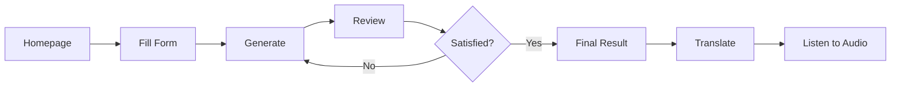

# User Guide

## Table of Contents
- [Welcome to AfflimAI](#welcome-to-afflimai)
- [Getting Started](#getting-started)
- [Creating Your Manifestation](#creating-your-manifestation)
- [Translating Your Manifestation](#translating-your-manifestation)
- [Listening to Audio](#listening-to-audio)
- [Tips for Meaningful Manifestations](#tips-for-meaningful-manifestations)
- [Frequently Asked Questions](#frequently-asked-questions)

---

## Welcome to AfflimAI

AfflimAI is your personal AI-powered manifestation companion that creates unique, personalized affirmations based on:

✨ **Your Astrological Blueprint** - Nakshatra and Lagna alignment  
🧠 **Your Psychological Profile** - Strengths, goals, and aspirations  
🌍 **Multiple Languages** - English, Tamil (தமிழ்), and Hindi (हिन्दी)  
🎧 **Soothing Audio** - Native voices for each language

### What You'll Experience

1. **Personalized Content**: Every manifestation is uniquely yours
2. **Cultural Authenticity**: Translations preserve emotional depth
3. **Audio Immersion**: Listen to your manifestations anytime
4. **Quick Access**: Auto-fill feature for returning users

---

## Getting Started

### Accessing AfflimAI

1. Open your web browser
2. Navigate to the AfflimAI application URL
3. You'll see the beautiful landing page with the form

### Understanding the Interface



---

## Creating Your Manifestation

### Step-by-Step Guide

#### 1. Personal Information

Fill in your basic details:

**Preferred Name** 
- Enter the name you'd like to be addressed by in your manifestation
- Example: "Priya", "Rajesh", "Suhani"

**Birth Date**
- Your date of birth (used for astrological calculations)
- Format: Select from calendar picker
- Example: May 15, 1990

#### 2. Astrological Information

These ancient Vedic concepts help align your manifestation with cosmic energy.

**Nakshatra (Birth Star)** ⭐
- Your Vedic birth star
- 27 Nakshatras in Vedic astrology
- Examples: Ashwini, Rohini, Pushya, Swati
- Don't know yours? [Calculate here](https://www.vedicastrology.us.com/nakshatras.asp)

**Birth Time**
- Time of your birth
- Format: HH:MM (24-hour)
- Example: 06:30 or 18:45

**Birth Place**
- City or town where you were born
- Example: "Chennai", "Mumbai", "Delhi"

**Lagna (Ascendant)** 🌅
- Your rising sign
- Based on birth time and location
- Examples: Aries, Taurus, Cancer
- Don't know yours? [Calculate here](https://www.astrosage.com/lagna-calculator.asp)

> [!TIP]
> **Don't Know Your Astrological Details?**
> 
> You can still use AfflimAI! If you don't have your Nakshatra or Lagna:
> - Use "Unknown" or "General"
> - The AI will focus more on your personal goals and achievements
> - Your manifestation will still be personalized and powerful

#### 3. Self-Reflection

**Your Strengths** 💪
- What are you naturally good at?
- What do people compliment you on?
- Examples: "Leadership, Creativity, Empathy", "Problem-solving, Communication"

**Areas of Improvement** 🌱
- What would you like to develop?
- Where do you see growth opportunities?
- Examples: "Time management, Patience", "Public speaking, Assertiveness"

#### 4. Achievements & Goals

**Greatest Achievement** 🏆
- Your proudest accomplishment so far
- Can be personal or professional
- Example: "Started my own business", "Completed my degree while working"

**Recent Achievement** ✨
- Something you've accomplished recently
- Keeps the manifestation current and relevant
- Example: "Promoted to team lead", "Published my first article"

**Next Year Goals** 🎯
- What do you want to achieve in the next 12 months?
- Be specific and ambitious
- Example: "Grow revenue to 1Cr, Hire 10 people, Launch new product"

**Life Goals** 🌟
- Your long-term vision
- What does success look like for you?
- Example: "Build sustainable businesses that create jobs"

**Legacy** 🕊️
- How do you want to be remembered?
- What impact do you want to leave?
- Example: "Mentor next generation entrepreneurs", "Create positive change"

#### 5. Manifestation Focus

Choose your primary focus area:

- **Abundance & Prosperity** 💰 - Wealth, success, opportunities
- **Peace & Harmony** ☮️ - Inner calm, balance, serenity
- **Love & Relationships** ❤️ - Connection, compassion, family
- **Health & Vitality** 🌿 - Physical wellness, energy, longevity
- **Success & Achievement** 🎖️ - Goals, recognition, accomplishments
- **Creativity & Expression** 🎨 - Innovation, artistry, self-expression
- **Wisdom & Knowledge** 📚 - Learning, growth, enlightenment

#### 6. Generate!

Click **"Generate My Manifestation"** and wait while the AI creates your unique passage (takes ~10-15 seconds).

---

## Reviewing Your Manifestation

### What to Expect

You'll receive a personalized 500-word manifestation passage that:

✅ Addresses you by name  
✅ References your astrological influences  
✅ Acknowledges your strengths and achievements  
✅ Inspires growth in areas you've identified  
✅ Aligns with your goals and aspirations  
✅ Resonates with your manifestation focus  

### Review Options

**Option 1: This Looks Perfect! ✓**
- You're happy with the generated text
- Click to proceed to the final result
- You can now translate or generate audio

**Option 2: Regenerate 🔄**
- Not quite what you wanted
- Click to generate a completely new manifestation
- Same inputs, different creative output

**Option 3: Edit (Advanced)**
- The manifestation is displayed in an editable text area
- You can modify any part of it
- Make it uniquely yours

> [!TIP]
> **Editing Your Manifestation**
> 
> Feel free to:
> - Change specific words or phrases
> - Add personal touches
> - Adjust the tone or emphasis
> - Make it resonate more deeply with you

---

## Translating Your Manifestation

### Why Translate?

- **Cultural Connection**: Experience manifestations in your mother tongue
- **Deeper Resonance**: Words have more emotional impact in your native language
- **Accessibility**: Share with family members who prefer Tamil or Hindi

### How to Translate

1. From the **Final Result** screen, scroll to "Translate to Your Language"
2. Choose your target language:
   - **தமிழ் (Tamil)**
   - **हिन्दी (Hindi)**
3. Click the language button
4. Wait for translation (~30-40 seconds first time, ~5-8 seconds if you've translated before)
5. View your beautifully translated manifestation

### Translation Quality

AfflimAI uses RAG (Retrieval-Augmented Generation) technology to ensure:

✨ **Culturally Appropriate**: Translations respect cultural nuances  
✨ **Emotionally Resonant**: Preserves the feeling and intent  
✨ **Consistent**: Same phrases translate the same way  
✨ **Context-Aware**: Uses past translations as examples  

### Supported Languages

| Language | Native Name | Voice Support |
|----------|-------------|---------------|
| English | English | ✅ Male & Female |
| Tamil | தமிழ் | ✅ Male & Female |
| Hindi | हिन्दी | ✅ Male & Female |

---

## Listening to Audio

### Why Audio?

- **Daily Affirmations**: Listen during your morning routine
- **Meditation**: Use as background for meditation
- **Subconscious Programming**: Listen while sleeping
- **Convenience**: Audio is portable and hands-free

### Generating Audio

#### Step 1: Select Language

Choose which version you want to hear:
- **English**: Original manifestation
- **Tamil (தமிழ்)**: Tamil translation (must translate first)
- **Hindi (हिन्दी)**: Hindi translation (must translate first)

> [!NOTE]
> You must translate to a language before you can generate audio in that language.

#### Step 2: Choose Voice Gender

Select your preferred voice:
- **Male Voice** 🎙️ - Deep, authoritative, grounding
- **Female Voice** 🎤 - Warm, nurturing, soothing

#### Step 3: Generate

Click **"Generate [Language] Audio"** and wait (~5-10 seconds).

#### Step 4: Listen or Download

- **Play in Browser**: Click the play button
- **Download**: Save the MP3 file to your device
- **Share**: Send to your phone for mobile listening

### Audio Quality

- **Format**: High-quality MP3
- **Duration**: ~5 minutes (for 500-word manifestation)
- **Voices**: Native, natural-sounding voices for each language
- **Speaking Rate**: Optimized for listening and absorption

### Voice Options

| Language | Male Voice | Female Voice |
|----------|------------|--------------|
| English | Prabhat (Indian accent) | Neerja (Indian accent) |
| Tamil | Valluvar | Pallavi |
| Hindi | Madhur | Swara |

---

## Tips for Meaningful Manifestations

### 1. Be Honest and Authentic

- Share your true strengths and areas of growth
- Don't inflate or diminish yourself
- Authenticity creates resonance

### 2. Be Specific with Goals

❌ "I want to be successful"  
✅ "Grow my business to 10Cr revenue, expand to 5 cities"

Specific goals create specific manifestations.

### 3. Balance Past, Present, and Future

- **Past**: Acknowledge achievements (builds confidence)
- **Present**: Recognize current strengths (grounds you)
- **Future**: Articulate clear goals (provides direction)

### 4. Use Emotional Language

Include how you want to **feel**:
- "I feel abundant and grateful"
- "I radiate confidence and peace"
- "I am filled with creative energy"

### 5. Make It a Daily Practice

- **Morning**: Listen to set positive intentions for the day
- **Evening**: Listen to reflect and reinforce beliefs
- **Meditation**: Use as a guided visualization aid

### 6. Update Regularly

As you grow and achieve:
- Generate new manifestations quarterly
- Update goals to reflect new aspirations
- Celebrate progress and set new intentions

---

## Frequently Asked Questions

### General Questions

**Q: Is my data saved?**  
A: Your form data is saved locally on the server for the auto-fill feature. Each user's last submission is stored to make repeat usage convenient.

**Q: Can I use AfflimAI without astrological details?**  
A: Yes! While astrological inputs enrich the manifestation, you can enter "General" or "Unknown" if you don't have these details.

**Q: How long does manifest generation take?**  
A: ~10-15 seconds for generation, ~30-40 seconds for first-time translation, ~5-8 seconds for cached translations.

**Q: Can I edit my manifestation?**  
A: Yes, in the review stage, the manifestation is displayed in an editable text area where you can make any changes.

### Translation Questions

**Q: Why is translation slow the first time?**  
A: The RAG system generates embeddings, searches the vector database, and creates context-aware translations. Subsequent translations are much faster due to caching.

**Q: Will translations always be the same?**  
A: For the same input text, yes. The vector database ensures consistency across translations.

**Q: Can I request a new language?**  
A: Language support depends on availability of models and voices. Contact the developer to request additions.

### Audio Questions

**Q: Why can't I generate audio in a language I haven't translated to?**  
A: You must first translate your manifestation to that language. The audio feature uses the translated text.

**Q: Can I change the voice after generating audio?**  
A: Yes! Just select a different gender and regenerate. You can create multiple versions with different voices.

**Q: Can I use this audio commercially?**  
A: The audio is for personal use. Check Microsoft Edge TTS terms for commercial usage.

### Technical Questions

**Q: What browsers are supported?**  
A: Modern browsers (Chrome, Firefox, Safari, Edge) with JavaScript enabled.

**Q: Can I use this on mobile?**  
A: Yes! The interface is responsive and works on mobile browsers. Download audio to your device for offline listening.

**Q: My audio won't play. What should I do?**  
A: Ensure your browser supports MP3 playback. Try downloading the file and playing it in a media player.

---

## Best Practices for Manifestation

### The Science of Manifestation

Manifestations work by:
1. **Clarifying Goals**: Writing specific goals makes them real
2. **Positive Self-Talk**: Repeated affirmations reshape beliefs
3. **Visualization**: Imagining success activates neural pathways
4. **Emotional Engagement**: Feeling the emotions creates motivation

### Using Your Manifestation Effectively

**Daily Practice**:
```
Morning Routine:
  └─ Listen to audio (5 min)
  └─ Read text version (2 min)
  └─ Visualize goals (3 min)

Evening Reflection:
  └─ Read before sleep (5 min)
  └─ Journal progress (5 min)
```

**Integration Ideas**:
- Set as phone alarm/reminder
- Print and place on vision board
- Record yourself reading it
- Share with accountability partner

**Measuring Impact**:
- Weekly: Notice mindset shifts
- Monthly: Track goal progress
- Quarterly: Update manifestation
- Yearly: Reflect on achievements

---

## Resources

### Learn More About

- [Vedic Astrology Basics](https://www.vedicastrology.us.com/)
- [Nakshatra Calculator](https://www.vedicastrology.us.com/nakshatras.asp)
- [Lagna Calculator](https://www.astrosage.com/lagna-calculator.asp)
- [Manifestation Science](https://www.psychologytoday.com/us/blog/the-psychology-of-meditation)

### Support

- **Report Issues**: Contact the developer
- **Feature Requests**: Submit suggestions
- **Feedback**: Share your experience

---

## Your Manifestation Journey

Remember:

> **"Your thoughts create your reality. Your words shape your destiny. Your beliefs determine your life."**

💫 **Be intentional** with what you manifest  
🌟 **Be consistent** in your practice  
✨ **Be open** to transformation  

Happy manifesting! 🙏

---

*Last Updated: January 2, 2026*
