# AfflimAI Complete Workflow

This document provides a comprehensive overview of the complete workflow in AfflimAI, from user input to final audio output.

## Table of Contents
- [Overview](#overview)
- [User Journey](#user-journey)
- [Manifestation Generation Workflow](#manifestation-generation-workflow)
- [Translation Workflow (RAG)](#translation-workflow-rag)
- [Audio Generation Workflow](#audio-generation-workflow)
- [Data Flow Architecture](#data-flow-architecture)
- [State Management](#state-management)

---

## Overview

AfflimAI follows a multi-stage workflow:

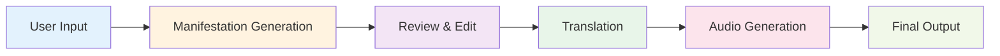

**Key Stages**:
1. **Input Collection** - User fills manifestation form
2. **AI Generation** - Create personalized manifestation
3. **Review** - User reviews and optionally edits
4. **Translation** - RAG-based multi-language translation
5. **Audio** - Text-to-speech in selected language
6. **Output** - Download/listen to final manifestation

---

## User Journey

### Complete User Flow

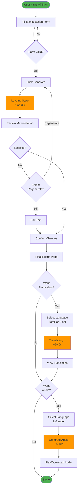

### Frontend State Machine

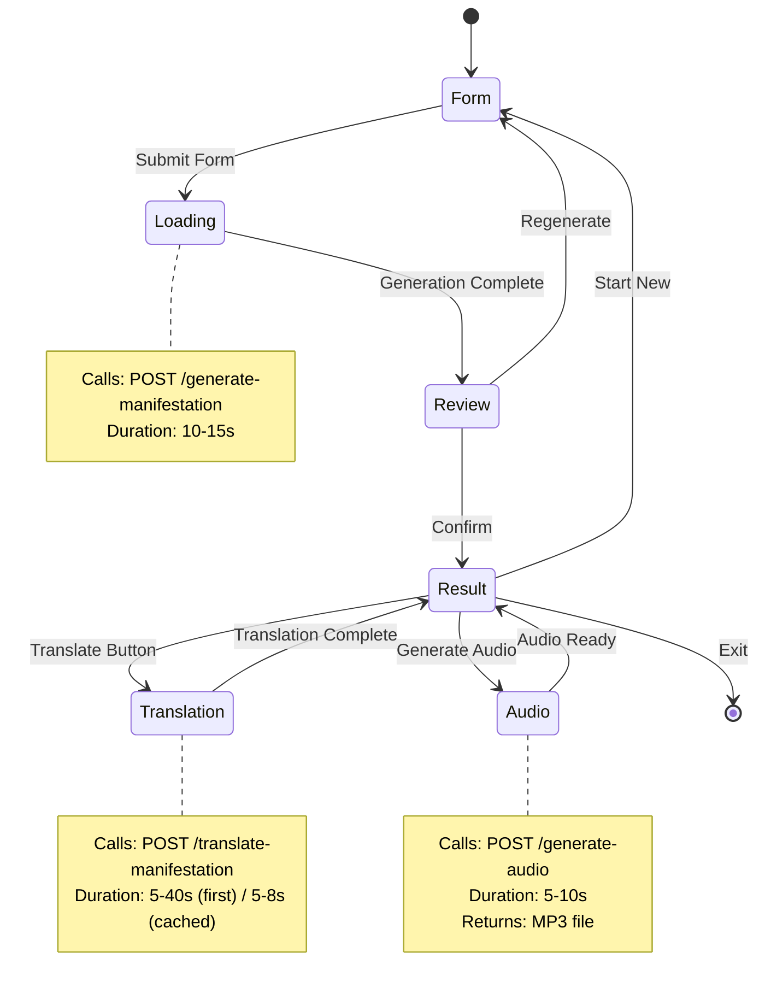

---

## Manifestation Generation Workflow

### Step-by-Step Process

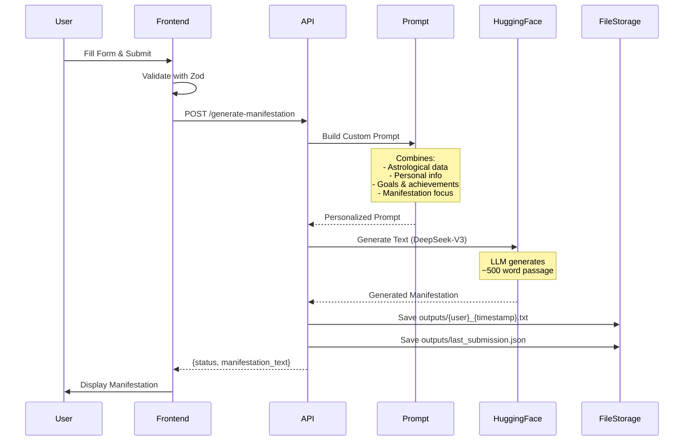

### Prompt Engineering

The system builds a rich prompt from user inputs:

**Template Structure**:
```
I am {name}, born on {birth_date} under the {nakshatra} nakshatra.
My Lagna is {lagna}, which influences my {zodiac_traits}.

STRENGTHS: {strengths}
AREAS TO IMPROVE: {areas_of_improvement}

GREATEST ACHIEVEMENT: {greatest_achievement}
RECENT WIN: {recent_achievement}

NEXT YEAR GOALS: {next_year_goals}
LIFE VISION: {life_goals}
LEGACY: {legacy}

MANIFESTATION FOCUS: {manifestation_focus}

Generate a 500-word manifestation passage that...
[specific AI instructions]
```

**Output Example**:
> "I am Rajesh, born under the dynamic Ashwini Nakshatra with Aries as my Lagna. The cosmic energies of initiation and swift action flow through me, aligning perfectly with my natural leadership abilities..."

---

## Translation Workflow (RAG)

### Complete RAG Pipeline

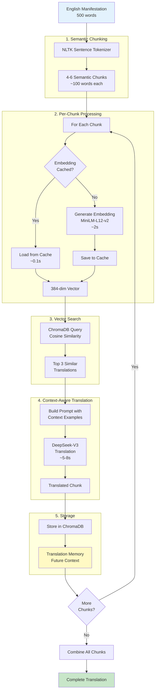

### Detailed Sequence

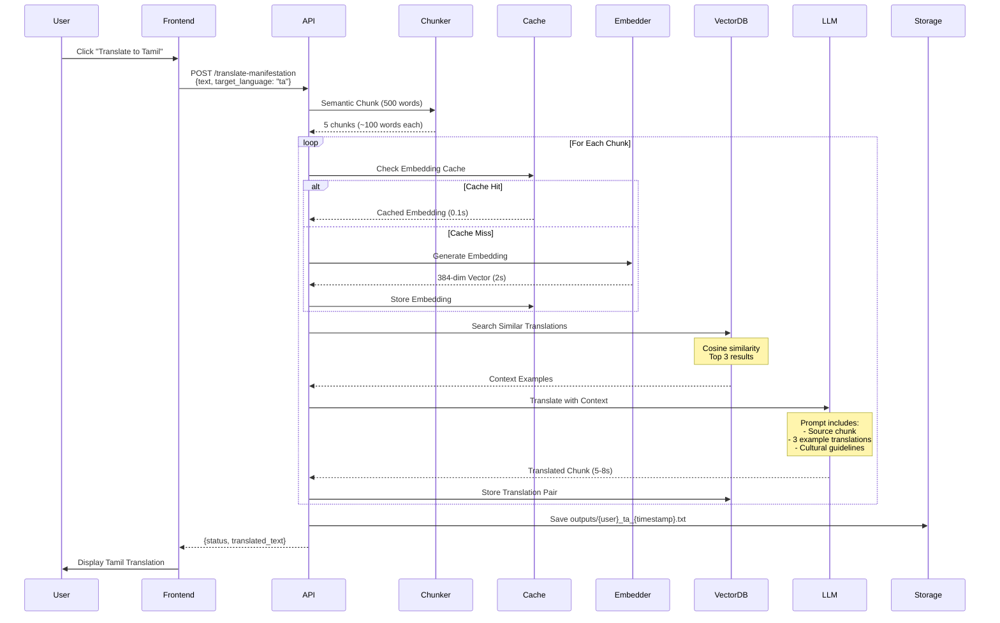

### Performance Timeline

| Step | First Time | Cached | Notes |
|------|-----------|---------|-------|
| Chunking | 0.5s | 0.5s | NLTK processing |
| Embedding (5 chunks) | 10s | 0.5s | **90% cache benefit** |
| Vector Search (5x) | 0.5s | 0.5s | Fast ChromaDB queries |
| LLM Translation (5x) | 25-40s | 25-40s | API-dependent |
| **Total** | **35-50s** | **26-41s** | Cache saves 9s |

---

## Audio Generation Workflow

### TTS Process

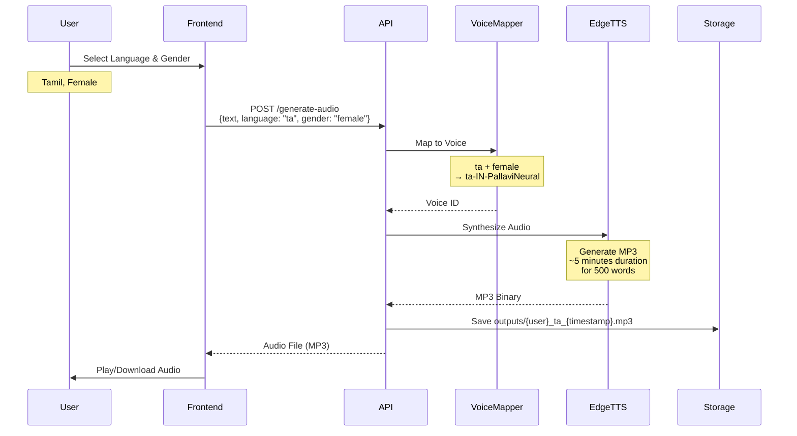

### Voice Selection Matrix

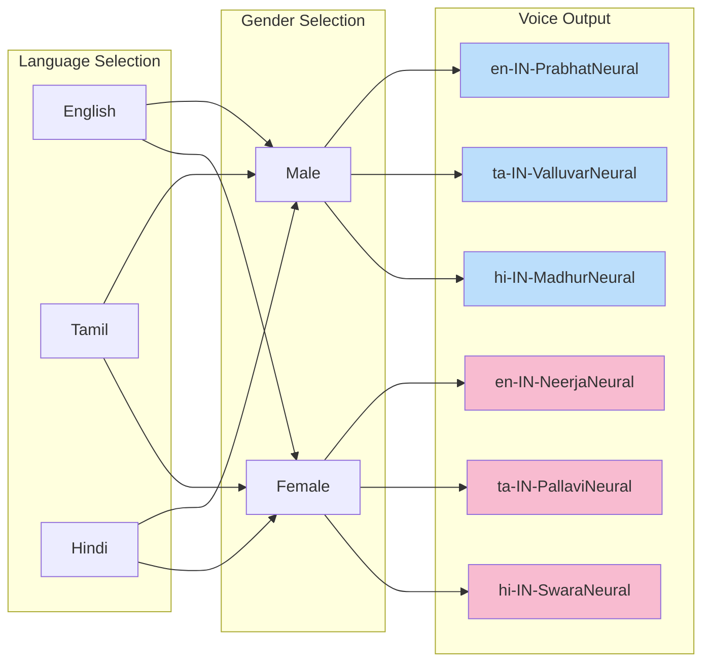

---

## Data Flow Architecture

### Complete System Data Flow

```mermaid
graph TB
    subgraph "Frontend Layer"
        UI[React UI]
        Form[Manifestation Form]
        Result[Result Display]
        Audio[Audio Player]
    end
    
    subgraph "API Layer"
        Router[FastAPI Router]
        ManifestEndpoint[/generate-manifestation]
        TransEndpoint[/translate-manifestation]
        TTSEndpoint[/generate-audio]
        UtilEndpoint[/last-submission]
    end
    
    subgraph "Service Layer"
        PromptService[Prompt Generator]
        HFClient[Hugging Face Client]
        RAGService[RAG Translator]
        TTSService[TTS Service]
    end
    
    subgraph "Infrastructure Layer"
        Embedder[Embedding Generator]
        VectorDB[(ChromaDB<br/>Vector Store)]
        Cache[(Embedding Cache)]
        Files[(File Storage<br/>outputs/)]
    end
    
    subgraph "External Services"
        HF[Hugging Face API<br/>DeepSeek-V3]
        EdgeTTS[Microsoft Edge TTS]
    end
    
    UI --> Form
    Form --> Router
    Router --> ManifestEndpoint
    ManifestEndpoint --> PromptService
    PromptService --> HFClient
    HFClient --> HF
    HF --> Files
    
    Result --> TransEndpoint
    TransEndpoint --> RAGService
    RAGService --> Embedder
    Embedder --> Cache
    RAGService --> VectorDB
    RAGService --> HFClient
    
    Result --> TTSEndpoint
    TTSEndpoint --> TTSService
    TTSService --> EdgeTTS
    EdgeTTS --> Files
    
    Audio --> Files
    
    style UI fill:#e1f5fe
    style VectorDB fill:#fff9c4
    style Cache fill:#f3e5f5
    style Files fill:#fff3e0
    style HF fill:#ffccbc
    style EdgeTTS fill:#ffccbc
```

### Request/Response Flow

**1. Manifestation Generation**
```
User → Frontend → API → Prompt → HF → Storage → API → Frontend → User
Time: 10-15 seconds
```

**2. Translation (First Time)**
```
User → Frontend → API → Chunker → [Embedder → Cache → VectorDB → LLM] × 5 → Storage → API → Frontend → User
Time: 30-40 seconds
```

**3. Translation (Cached)**
```
User → Frontend → API → Chunker → [Cache → VectorDB → LLM] × 5 → Storage → API → Frontend → User
Time: 5-8 seconds
```

**4. Audio Generation**
```
User → Frontend → API → VoiceMapper → EdgeTTS → Storage → API → Frontend → User
Time: 5-10 seconds
```

---

## State Management

### Frontend State Flow

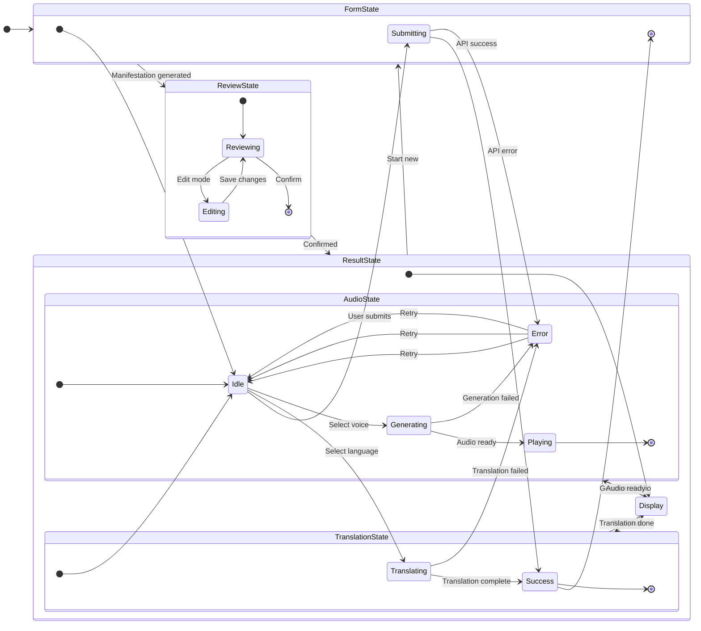

### Backend State Handling

**Manifestation Endpoint**:
```python
Request → Validate → Generate Prompt → Call LLM → Save Files → Response
States: [received, validating, generating, saving, complete, error]
```

**Translation Endpoint**:
```python
Request → Validate Language → Chunk Text → [Embed → Search → Translate] × N → Combine → Save → Response
States: [received, chunking, translating_chunk_1..N, combining, saving, complete, error]
```

**Audio Endpoint**:
```python
Request → Select Voice → Synthesize → Save → Stream Response
States: [received, synthesizing, saving, streaming, complete, error]
```

---

## File Storage Organization

### Directory Structure

```
outputs/
├── Rajesh_20260102_100530.txt              # Original manifestation
├── Rajesh_ta_20260102_100645.txt           # Tamil translation
├── Rajesh_hi_20260102_100712.txt           # Hindi translation
├── Rajesh_en_20260102_100730.mp3           # English audio
├── Rajesh_ta_20260102_100745.mp3           # Tamil audio
└── last_submission.json                     # Auto-fill data

chroma_db/
└── translations_Rajesh/                     # User-specific collection
    ├── metadata.json
    └── data/                                # Vector embeddings

cache/
└── embedding_cache.json                     # Embedding cache
```

### Naming Convention

- **Manifestations**: `{username}_{timestamp}.txt`
- **Translations**: `{username}_{lang_code}_{timestamp}.txt`
- **Audio**: `{username}_{lang_code}_{timestamp}.mp3`
- **Timestamp Format**: `YYYYMMDD_HHMMSS`

---

## Error Handling Workflow

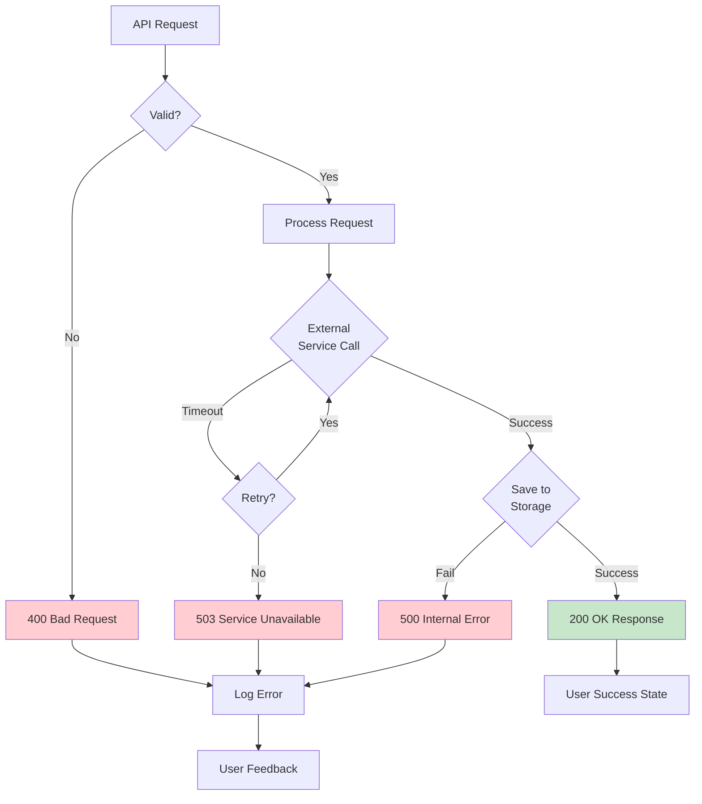

---

## Performance Optimization Flow

### Caching Strategy

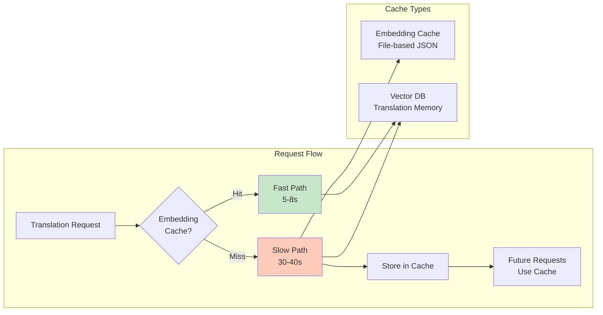

---

## Summary: End-to-End Flow

**Complete User Journey** (First-time user):
```
1. Fill Form (2 min) 
   → 2. Generate Manifestation (15s)
   → 3. Review & Edit (1 min)
   → 4. Translate to Tamil (35s)
   → 5. Generate Tamil Audio (8s)
   → 6. Listen/Download
   
Total Time: ~4 minutes
```

**Returning User** (with cached data):
```
1. Auto-fill Form (5s)
   → 2. Generate Manifestation (15s)
   → 3. Quick Review (10s)
   → 4. Translate to Hindi (7s - cached)
   → 5. Generate Hindi Audio (8s)
   → 6. Listen/Download
   
Total Time: ~45 seconds
```

---

*Last Updated: January 2, 2026*
